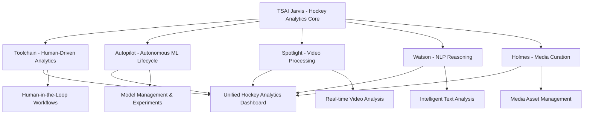

# TSAI Ecosystem Integration Implementation Plan

## Overview

This document outlines the implementation plan for integrating TSAI Jarvis with the complete TSAI ecosystem, focusing on Toolchain (human-driven analytics) and Autopilot (autonomous ML lifecycle) as primary priorities.

## Integration Architecture

## Priority 1: Toolchain Integration (Human-Driven Analytics)

### Core Capabilities
- **Human-in-the-Loop Workflows**: Human approval gates for critical analytics decisions
- **Interactive Analytics**: Real-time human feedback and parameter tuning
- **Annotation Tools**: Human-guided data labeling and validation
- **Workflow Orchestration**: Human-driven pipeline management
- **Quality Assurance**: Human oversight for analytics accuracy

### Implementation Details

#### 1. Human-Driven Analytics API
- **Endpoint**: `http://localhost:8013`
- **Purpose**: Bridge between Jarvis analytics and human decision-making
- **Features**:
  - Human approval workflows
  - Interactive parameter tuning
  - Real-time feedback collection
  - Quality assurance gates

#### 2. Interactive Dashboard Components
- **Human Approval Interface**: Real-time approval requests
- **Parameter Tuning Tools**: Interactive sliders and controls
- **Annotation Interface**: Data labeling and validation tools
- **Workflow Monitor**: Human-driven pipeline status

#### 3. Integration Points
- **Jarvis Analytics → Toolchain**: Send analytics results for human review
- **Toolchain → Jarvis**: Return human-approved parameters and decisions
- **Real-time Collaboration**: WebSocket-based human feedback

## Priority 2: Autopilot Integration (Autonomous ML Lifecycle)

### Core Capabilities
- **Model Management**: Automated model training, versioning, and deployment
- **Experiment Tracking**: ML experiment orchestration and monitoring
- **Hyperparameter Optimization**: Automated hyperparameter tuning
- **Model Serving**: Real-time model inference and serving
- **Performance Monitoring**: Automated model performance tracking

### Implementation Details

#### 1. ML Lifecycle API
- **Endpoint**: `http://localhost:8014`
- **Purpose**: Orchestrate ML experiments and model management
- **Features**:
  - Experiment tracking and management
  - Model training orchestration
  - Hyperparameter optimization
  - Model deployment automation

#### 2. Model Management System
- **Model Registry**: Centralized model storage and versioning
- **Experiment Tracking**: ML experiment monitoring and comparison
- **Automated Training**: Scheduled model retraining workflows
- **A/B Testing**: Model performance comparison and selection

#### 3. Integration Points
- **Jarvis Analytics → Autopilot**: Send analytics data for model training
- **Autopilot → Jarvis**: Deploy trained models for real-time inference
- **Continuous Learning**: Automated model improvement workflows

## Secondary Priorities

### 3. Spotlight Integration (Video Processing)
- **Endpoint**: `http://localhost:8015`
- **Purpose**: Real-time video analysis and event detection
- **Features**: Video streaming, event detection, highlight generation

### 4. Watson Integration (NLP Reasoning)
- **Endpoint**: `http://localhost:8016`
- **Purpose**: Natural language processing and reasoning
- **Features**: Text analysis, sentiment analysis, intelligent monitoring

### 5. Holmes Integration (Media Curation)
- **Endpoint**: `http://localhost:8017`
- **Purpose**: Media asset management and curation
- **Features**: Asset indexing, content organization, search capabilities

## Service Mesh Architecture

### Inter-Service Communication
- **API Gateway**: Centralized routing and load balancing
- **Service Discovery**: Automatic service registration and discovery
- **Circuit Breakers**: Fault tolerance and error handling
- **Distributed Tracing**: End-to-end request tracking

### Data Flow
1. **Jarvis** receives hockey data and analytics requests
2. **Toolchain** provides human-driven analytics and approval
3. **Autopilot** manages ML models and experiments
4. **Spotlight** processes video data and detects events
5. **Watson** analyzes text and provides reasoning
6. **Holmes** manages media assets and content
7. **Unified Dashboard** presents integrated results

## Implementation Phases

### Phase 1: Toolchain Integration (Week 1-2)
- [ ] Implement Toolchain API service
- [ ] Create human-driven analytics workflows
- [ ] Build interactive dashboard components
- [ ] Integrate with Jarvis analytics

### Phase 2: Autopilot Integration (Week 3-4)
- [ ] Implement Autopilot API service
- [ ] Create ML lifecycle management
- [ ] Build experiment tracking system
- [ ] Integrate model serving with Jarvis

### Phase 3: Service Mesh (Week 5-6)
- [ ] Implement service discovery
- [ ] Create API gateway
- [ ] Add circuit breakers and monitoring
- [ ] Build unified dashboard

### Phase 4: Secondary Services (Week 7-8)
- [ ] Integrate Spotlight for video processing
- [ ] Integrate Watson for NLP reasoning
- [ ] Integrate Holmes for media curation
- [ ] Complete end-to-end workflows

## Success Metrics

- **Toolchain**: 95% human approval accuracy, < 2s response time
- **Autopilot**: 99% model deployment success, < 5min experiment setup
- **Service Mesh**: 99.9% uptime, < 100ms inter-service latency
- **Unified Experience**: Single dashboard for all TSAI capabilities

## Next Steps

1. **Start with Toolchain Integration**: Implement human-driven analytics API
2. **Build Interactive Components**: Create human approval and tuning interfaces
3. **Integrate with Jarvis**: Connect Toolchain workflows with Jarvis analytics
4. **Move to Autopilot**: Implement ML lifecycle management
5. **Complete Service Mesh**: Add inter-service communication and monitoring

---

*This implementation plan provides a structured approach to integrating all TSAI services with Jarvis, focusing on human-driven analytics and autonomous ML capabilities.*
